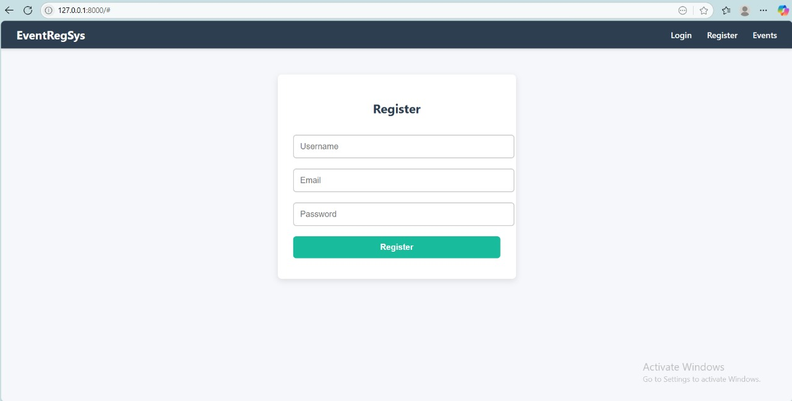
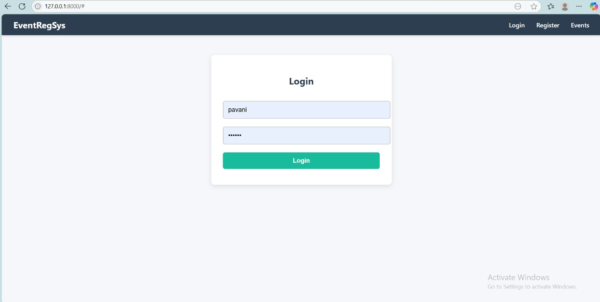
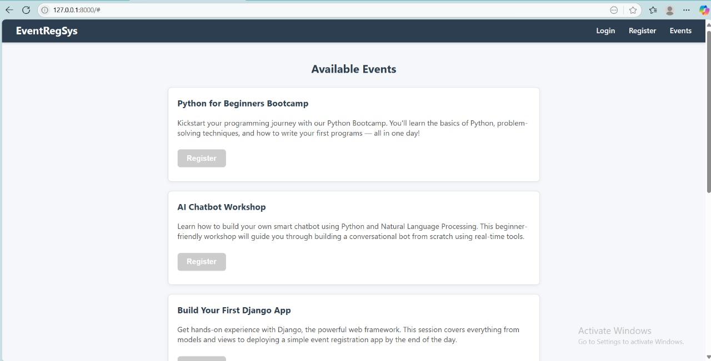
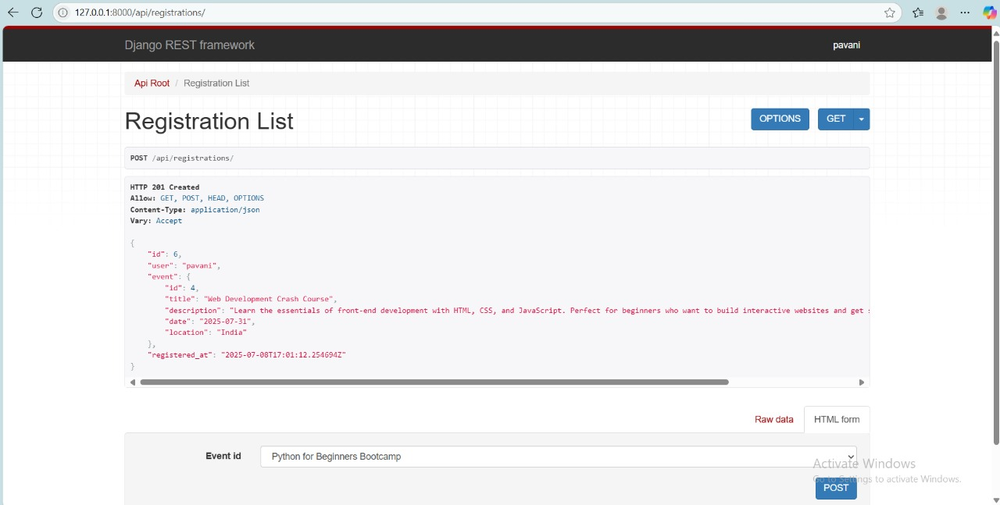

# Event Registration System

## Project Overview

This web application allows users to register, login, browse available events, and register for events securely. It features a clean and user-friendly interface with token-based authentication and integration with backend APIs.

---

## Features Demonstrated

| Feature             | Description                                         |
|---------------------|-----------------------------------------------------|
| User Registration   | New users can register with username, email, and password via `/api/register`. |
| User Login          | Registered users can login with credentials via `/api/login`. |
| View Events         | Users can view a list of available events fetched dynamically from `/api/events`. |
| Event Registration  | Logged-in users can register for events using `/api/registrations`. |

---

## How to Use

1. Open the application in your browser.
2. Click **Register** to create a new user account.
3. Fill in your username, email, and password, then submit.
4. After registration, click **Login** and enter your credentials.
5. Browse the **Events** page to see available events.
6. Click **Register** on an event to sign up.
7. Use the **Logout** option to end your session.

---

## API Endpoints

| Endpoint           | Method | Description                              |
|--------------------|--------|------------------------------------------|
| `/api/register/`   | POST   | Register a new user (username, email, password) |
| `/api/login/`      | POST   | Login user and receive authentication token |
| `/api/events/`     | GET    | Fetch list of available events            |
| `/api/registrations/` | POST | Register logged-in user for an event (event_id) |

---

## Screenshots

### Registration Form

### Login Form

### Events List

### Event Registration Success

---

## Technologies Used

- HTML, CSS, JavaScript for frontend  
- Token-based authentication for secure API calls  
- Backend APIs assumed for registration, login, events, and event registrations  

---

## Notes

- Ensure backend APIs are running and accessible for the frontend to work correctly.  
- CSRF tokens are handled for secure POST requests.  
- The frontend dynamically updates UI based on user login status.

---

## License

This project is licensed under the MIT License.

---

## Contact

For questions or support, contact:  
Pavani  
Email: pavanipitti50@gmail.com

